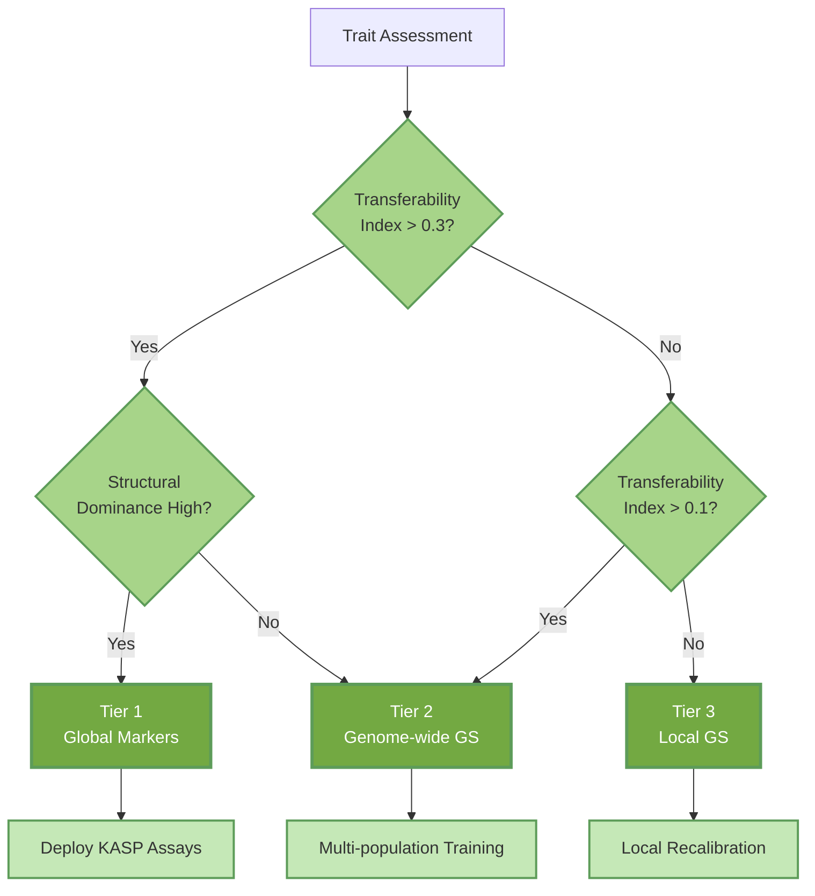

# Mango Structural Super-Genes

[](https://www.python.org/)
[](https://opensource.org/licenses/MIT)
[](https://tensorflow.org/)

**Structural haplotypes act as additive super-genes to bridge the genomic prediction cliff in mango**

---

## Overview

### The Challenge: The Structure Cliff

Genomic selection promises to accelerate tree crop breeding, but predictive accuracy often collapses when models are moved between ancestry groups—a **Structure Cliff**. This has quietly limited global breeding efforts, while remaining poorly quantified and mechanistically unexplained.

This repository contains the full, reproducible analysis behind a 225-accession *Mangifera indica* diversity panel spanning Indian, Southeast Asian, and Floridian gene pools. We ask, trait-by-trait:

- Which fruit quality traits retain predictive accuracy across ancestries?
- When can a small structural haplotype panel replace a dense genome-wide SNP panel?
- Does deep learning uncover hidden epistasis, or simply re-express additive structure?

### The Solution: Structural Super-Genes

The answer is that a handful of structural haplotypes behave as **additive super-genes**, preserving genomic prediction across ancestries for colour and vigour traits, while other traits (sugars, firmness) collapse into non-transferable, local polygenic architecture.

> This repository is intended for quantitative geneticists, breeders, and ML practitioners working on structured perennial crops.

---

## Key Findings

| Finding | Evidence |
|---------|----------|
| **Structure Cliff is trait-specific** | Under leave-cluster-out CV, cross-ancestry accuracy ranges from r ≈ 0.19 (FBC) to r < 0 for firmness and TSS, indicating complete failure for some traits. |
| **Inversions act as super-genes** | A 17-marker structural inversion panel captures ≈82% of the accuracy of a 19,790-SNP genome-wide panel for fruit blush colour and remains predictive across gene pools. |
| **Strict additivity confirmed** | Wide & Deep synergy scores explain <0.1% of variance beyond block main effects, supporting additive "super-gene" behaviour rather than pervasive hidden epistasis. |
| **Architecture trumps algorithm** | BINN gains are driven mostly by biologically informed feature selection; even with improved within-population r, cross-ancestry portability still fails for polygenic traits. |
| **Zero-cost breeder toolkit** | Public whole-genome sequencing is converted into a breeder-ready marker toolkit with no new genotyping required, using inversion panels and ancestry-aware thresholds. |

---

## Workflow Overview

The analysis is organised into four conceptual blocks:

1. **Core data construction (Idea 1)** — Build genotype–phenotype matrices and quantify the Structure Cliff under different CV schemes.
2. **Structural haplotypes (Idea 2)** — Define inversion-tagging marker panels and benchmark against matched random panels.
3. **Deep learning + interpretability (Idea 3)** — Train Wide & Deep models, run saliency/SHAP, and perform virtual allele editing.
4. **Biologically Informed Neural Network (BINN)** — Constrain the network to gene regions, estimate gene-level importance, and derive the Precision Breeding Hierarchy.

---

## Analysis Pipeline


---

## Precision Breeding Hierarchy



---

## Repository Structure

```
├── config/
│   ├── config_idea1.py                     # Genomic prediction parameters
│   ├── config_idea2.py                     # Structural analysis parameters
│   └── config_idea3.py                     # Deep learning parameters
│
├── 01_genomic_prediction/
│   ├── 01_build_core_matrices.py           # Build genotype/phenotype matrices from VCF
│   ├── 01b_het_qc.py                       # Heterozygosity-based paralog removal
│   ├── 02_gs_kfold_baseline.py             # Random K-fold cross-validation baseline
│   ├── 03_gs_structure_aware_cv.py         # Cluster-balanced and leave-cluster-out CV
│   ├── 04_internal_gwas_and_weights.py     # Internal GWAS for SNP weighting
│   ├── 04_gwas_to_snp_weights.py           # Convert GWAS to prediction weights
│   ├── 05_gs_weighted_and_fixed_effects.py # GWAS-weighted genomic selection
│   └── 06_idea1_summary.py                 # Summary statistics and reports
│
├── 02_structural_haplotypes/
│   ├── 01_prepare_idea2_datasets.py        # Prepare ML-ready datasets
│   ├── 02_define_cv_schemes_idea2.py       # Define cross-validation schemes
│   ├── 03_baseline_linear_models_idea2.py  # Ridge regression baselines
│   ├── 04_xgboost_and_rf_models_idea2.py   # XGBoost and Random Forest models
│   ├── 05_model_comparison_idea2.py        # Compare model performance
│   ├── 06_feature_importance_and_postgwas_links_idea2.py  # Feature importance
│   ├── 07_inversion_augmented_gs_idea2.py  # Inversion-augmented prediction
│   ├── 08_random_vs_inversion_control_idea2.py  # Random panel benchmarking
│   ├── 09_permutation_tests_idea2.py       # Permutation significance tests
│   ├── 10_build_gene_annotation_dict_idea2.py   # Gene annotation dictionary
│   ├── 11_build_candidate_gene_tables_idea2.py  # Candidate gene tables
│   ├── 11b_summarise_idea2_results.py      # Results summary
│   ├── 12_inspect_gene_mapping_idea2.py    # Gene mapping inspection
│   ├── 13_generate_manuscript_tables.py    # Generate manuscript tables
│   ├── 14_breeder_effect_catalogue.py      # Haplotype effect catalogue
│   ├── 15_generate_assay_sequences.py      # KASP assay flanking sequences
│   ├── 16_calc_genetic_gain.py             # Expected genetic gain calculation
│   └── 17_idea2_summary.py                 # Summary report
│
├── 03_deep_learning/
│   ├── 00_prep_gwas_summary.py             # Prepare GWAS summary for AI
│   ├── 01_ai_core_data.py                  # Prepare deep learning input data
│   ├── 02_cnn_tensor_builder.py            # Build CNN input tensors
│   ├── 03_train_cnn_single_trait.py        # Single-trait CNN training
│   ├── 04_train_wide_deep_multitask.py     # Multi-task Wide & Deep training
│   ├── 05_model_performance_summary.py     # Model performance metrics
│   ├── 06_ai_saliency_multitrait.py        # Gradient saliency analysis
│   ├── 07_wide_deep_decomposition.py       # Wide vs Deep decomposition
│   ├── 08_virtual_editing_scenarios.py     # In silico allele editing
│   ├── 08c_final_virtual_editing.py        # Final virtual editing analysis
│   ├── 08d_xgboost_verification.py         # XGBoost verification of effects
│   └── 09_ai_vs_gwas_concordance.py        # AI–GWAS concordance analysis
│
├── 04_binn/
│   ├── 10_binn_build_maps.py               # SNP-to-gene connectivity maps
│   ├── 11_binn_model.py                    # BINN architecture definition
│   ├── 12_binn_train.py                    # BINN training pipeline
│   ├── 13_binn_explain.py                  # BINN interpretability analysis
│   ├── 18_export_polygenic_weights.py      # Export polygenic weight vectors
│   ├── 19_shap_robustness_check.py         # SHAP robustness validation
│   ├── 20_generate_hierarchy_figure.py     # Precision breeding hierarchy
│   └── 21_binn_linear_baseline.py          # BINN decomposition analysis
│
├── figures/
│   ├── figure_config.py                    # Shared figure configuration
│   ├── figure_1.py                         # Population structure and structure cliff
│   ├── figure_2.py                         # Structural haplotypes as predictors
│   ├── figure_3.py                         # Deep learning confirms additivity
│   ├── figure_4.py                         # Polygenic backbones and gene hubs
│   ├── figure_5.py                         # Precision breeding hierarchy
│   ├── figure_S1.py                        # Phenotype distributions and PC3-PC4
│   ├── figure_S2.py                        # GWAS landscape and inversion context
│   ├── figure_S3.py                        # CV diagnostics and structure correction
│   ├── figure_S4.py                        # Random vs inversion panel benchmarks
│   ├── figure_S5.py                        # Deep learning saliency and GWAS concordance
│   └── figure_S6.py                        # BINN training and hub gene details
│
├── requirements.txt
└── README.md
```

---

## Installation

Clone the repository and create the conda environment:

```bash
git clone https://github.com/shoaibms/mango.git
cd mango

# Create environment (environment.yml defines the name 'mango-gs')
conda env create -f environment.yml
conda activate mango-gs

# Alternatively, with pip:
# python -m venv venv
# source venv/bin/activate        # or venv\Scripts\activate on Windows
# pip install -r requirements.txt
```

---

## Quick Start: Reproduce Core Results

After activating the environment from the project root:

```bash
# 1. Build core genotype + phenotype matrices (Idea 1)
python 01_genomic_prediction/01_build_core_matrices.py

# 2. Run structure-aware genomic prediction and Structure Cliff analysis
python 01_genomic_prediction/03_gs_structure_aware_cv.py

# 3. Benchmark structural inversion panels vs random panels (Idea 2)
python 02_structural_haplotypes/08_random_vs_inversion_control_idea2.py

# 4. Train Wide & Deep and run final virtual editing (Idea 3)
python 03_deep_learning/04_train_wide_deep_multitask.py
python 03_deep_learning/08c_final_virtual_editing.py

# 5. Train BINN and generate the Precision Breeding Hierarchy
python 04_binn/12_binn_train.py
python 04_binn/20_generate_hierarchy_figure.py
```

Each script writes CSV outputs into the `output/` tree and figures (PDF/PNG) into `figures/`. Figure scripts are one-to-one with the manuscript's main figures.

---

## Zero-Cost Deployment for Breeding Programs

A central design goal of this work is **zero marginal genotyping cost**:

- We take existing public WGS data and derive a **minimal inversion and marker toolkit**.
- These markers are designed for KASP (or similar) assays and validated under cross-ancestry prediction.
- This makes it possible to deploy global, ancestry-aware selection for key traits without generating a single new genotype.

Breeding programs can adopt Tier 1 structural panels immediately and layer genomic selection (Tier 2) or local recalibration (Tier 3) only where justified.

---

## Deep Learning for Mechanism, Not Just Prediction

We utilise Wide & Deep networks and Biologically Informed Neural Networks (BINN) not to chase marginal accuracy gains, but as **hypothesis-testing engines**:

| Approach | Insight |
|----------|---------|
| **Saliency Mapping** | Prediction relies on diffuse polygenic backbones, except where structural "knobs" exist |
| **Virtual Allele Editing** | Structural haplotypes act as quasi-Mendelian, additive units with no trade-offs |
| **BINN Decomposition** | ~60% of accuracy gains from biologically informed feature selection; ~40% from architecture |
| **No Cryptic Epistasis** | Models confirm the structure cliff is architectural, not a failure of linear modelling |

---

## Data

This study re-analyses publicly available data:

- **Genotypes:** Munyengwa et al. (2025) — 225 accessions, ~10M SNPs
- **Inversions:** Wilkinson et al. (2025) — 17 megabase-scale structural variants


---

## Requirements

| Package | Version |
|---------|---------|
| Python | ≥3.9 |
| NumPy | ≥1.21 |
| pandas | ≥1.4 |
| scikit-learn | ≥1.0 |
| XGBoost | ≥1.6 |
| TensorFlow | ≥2.10 |
| SHAP | ≥0.41 |

---

## Beyond Mango

Although developed in mango, the framework is generic:

- **Structured perennials:** coffee, cacao, citrus, grapevine, avocado, apple.
- **Tiered deployment:** identify traits suitable for global markers vs full GS vs local, cluster-specific models.
- **Mechanistic ML:** use deep learning primarily for **mechanistic dissection** (saliency, SHAP, virtual editing, BINN), not just for small accuracy gains.

The codebase is modular and can be adapted to other species with minimal changes to the input genotype/phenotype formats.

---

## Citation

If you use this code or concepts in your work, please cite:

```
[Citation to be added upon publication]
```

---

## License

MIT License — see [LICENSE](LICENSE) for details.

---

## Contact

**Shoaib M. Mirza** — <shoaibmirza2200@gmail.com>

Project: <https://github.com/shoaibms/mango>
