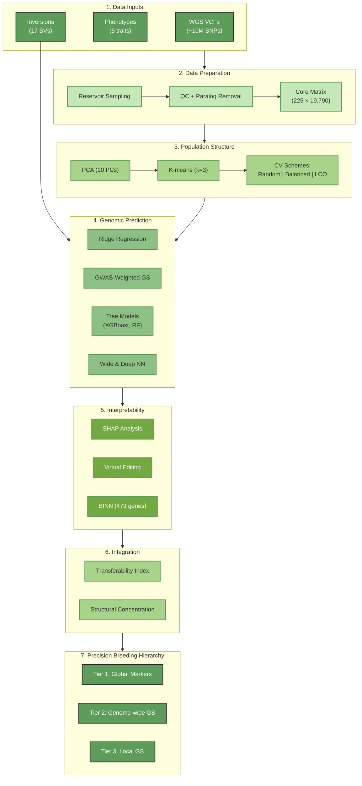
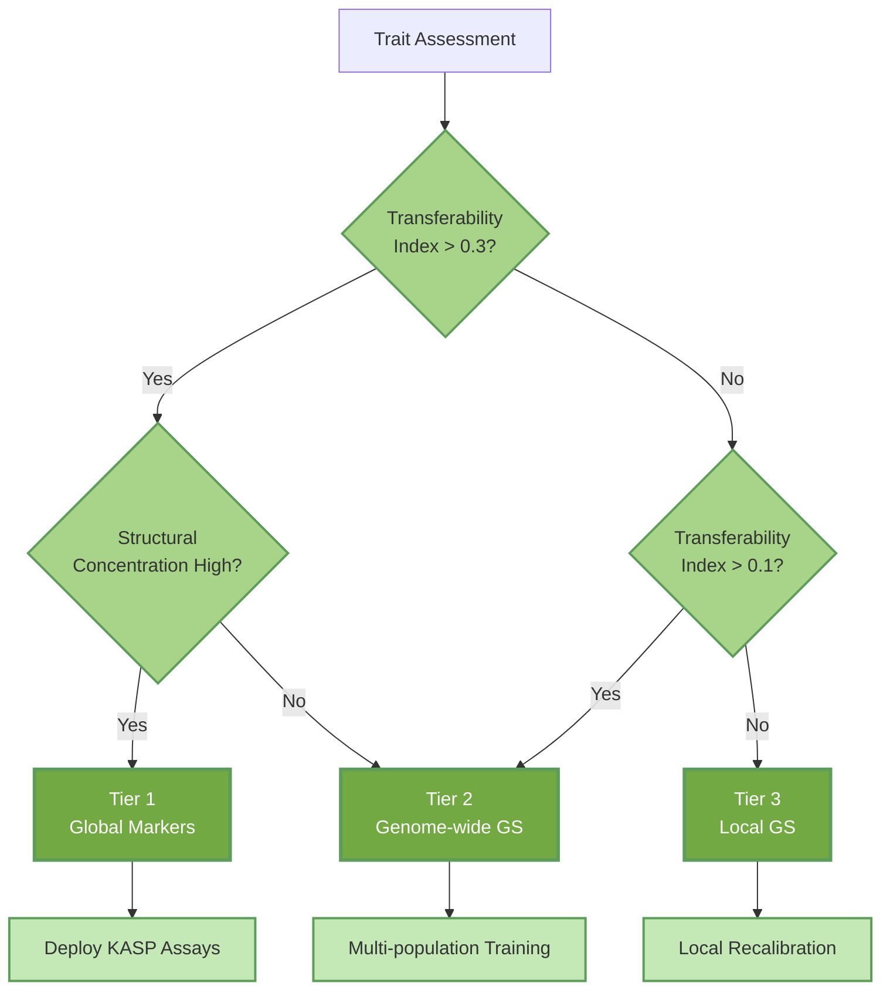

# Mango Structural Haplotypes

[](https://www.python.org/)
[](https://opensource.org/licenses/MIT)
[](https://tensorflow.org/)

**Structural haplotypes act as supergene-like additive units that partially mitigate the genomic prediction cliff in mango**

---

## Overview

### The Challenge: The Structure Cliff

Genomic prediction accuracy can decline sharply when models are transferred between ancestry groups (a "structure cliff"). Here we quantify this portability trait-by-trait in a 225-accession *Mangifera indica* diversity panel spanning three major ancestry clusters, using strict cross-validation schemes (random, cluster-balanced, and leave-cluster-out) with fold-wise PC correction.

### Key Result

We show that megabase-scale structural haplotypes (inversions) can behave as supergene-like, largely additive units for specific traits, preserving measurable cross-ancestry prediction for selected traits, whereas others collapse under leave-cluster-out transfer. We integrate marker-efficiency benchmarking, virtual editing additivity tests, and a gene-constrained BINN to link architecture to deployment strategy (Precision Breeding Hierarchy).

All portability claims here refer to structure-aware cross-validation within this 225-accession panel; broader transfer requires independent external panels.

> This repository is intended for quantitative geneticists, breeders, and ML practitioners working on structured perennial crops.

---

## Key Findings

| Finding | Evidence (from this study) |
|---------|----------------------------|
| **Portability is trait-specific (structure cliff)** | Under PC-corrected leave-cluster-out CV, cross-ancestry accuracy is positive for AFW (r=0.192), FBC (r=0.153), and TC (r=0.124), but collapses for FF (r=−0.094) and TSS (r=−0.056). |
| **Structural haplotypes support Tier-1 marker deployment for selected traits** | Precision Breeding Hierarchy assigns FBC and TC to Tier 1 (Global markers), AFW to Tier 2 (Genome-wide GS), and FF/TSS to Tier 3 (Local GS only), based on transferability and structural concentration. |
| **Predominantly additive behaviour within structural blocks** | Virtual editing shows joint block edits match the sum of single-locus edits; synergy terms are <0.1% of block effects across traits (e.g., FBC: 0.199 vs 0.199; synergy ≈ −6.29e−06). |
| **Deep learning is used for mechanism, not "hidden epistasis"** | Saliency landscapes are diffuse and concordance with GWAS significance is weak (e.g., FBC Spearman ρ=0.11), supporting interpretation as re-weighting additive signal rather than uncovering a distinct epistatic architecture. |
| **Breeder-facing deliverables from public data** | The workflow outputs KASP-ready sequences, haplotype effect catalogues, per-cycle gain projections, and open-source code derived from public WGS resources without additional discovery genotyping (cross-pool deployment still requires local validation). |

---

## Workflow Overview

The analysis is organised into four conceptual blocks:

1. **Genomic prediction (01_genomic_prediction/)** — Build genotype–phenotype matrices and quantify the structure cliff under different CV schemes.
2. **Structural haplotypes (02_structural_haplotypes/)** — Define inversion-tagging marker panels and benchmark against matched random panels.
3. **Deep learning (03_deep_learning/)** — Train Wide & Deep and BINN models, run saliency/SHAP, perform virtual allele editing, and derive the Precision Breeding Hierarchy.
4. **Validation (04_validation/)** — External validation against independent datasets.

---

## Analysis Pipeline



---

## Precision Breeding Hierarchy



---

## Repository Structure

```
mango/
├── README.md
├── requirements.txt
│
├── DATA_ACCESS.md                          # Data download guidance
│
├── config/
│   └── config.py                           # Shared configuration parameters
│
├── data/
│   └── data.7z                             # Compressed data archive
│
├── 01_genomic_prediction/
│   ├── 01_build_core_matrices.py           # Build genotype/phenotype matrices from VCF
│   ├── 02_paralog_filter.py                # Heterozygosity-based paralog removal
│   ├── 03_kfold_baseline.py                # Random K-fold cross-validation baseline
│   ├── 04_structure_aware_cv.py            # Cluster-balanced and leave-cluster-out CV
│   ├── 05_internal_gwas.py                 # Internal GWAS for SNP weighting
│   ├── 06_gwas_to_weights.py               # Convert GWAS statistics to prediction weights
│   ├── 07_weighted_prediction.py           # GWAS-weighted genomic selection
│   └── 08_summarise_results.py             # Summary statistics and reports
│
├── 02_structural_haplotypes/
│   ├── 01_prepare_datasets.py              # Prepare ML-ready datasets
│   ├── 02_define_cv_schemes.py             # Define cross-validation schemes
│   ├── 03_linear_baselines.py              # Ridge regression baselines
│   ├── 04_tree_models.py                   # XGBoost and Random Forest models
│   ├── 05_model_comparison.py              # Compare model performance across schemes
│   ├── 06_feature_importance.py            # Feature importance and post-GWAS links
│   ├── 07_inversion_prediction.py          # Inversion-augmented genomic prediction
│   ├── 08_random_panel_benchmark.py        # Random 17-SNP panel benchmarking
│   ├── 09_permutation_tests.py             # Permutation significance tests
│   ├── 10_gene_annotation.py               # Build gene annotation dictionary
│   ├── 11_candidate_genes.py               # Build candidate gene tables
│   ├── 12_results_summary_initial.py       # Initial results summary
│   ├── 13_gene_mapping_qc.py               # Gene mapping quality control
│   ├── 14_manuscript_tables.py             # Generate manuscript tables
│   ├── 15_effect_catalogue.py              # Breeder effect catalogue
│   ├── 16_kasp_assay_design.py             # KASP assay sequence generation
│   ├── 17_genetic_gain.py                  # Expected genetic gain calculation
│   ├── 18_summary_stats.py                 # Summary statistics
│   ├── 19_tag_snp_selection.py             # Tag SNP selection per inversion
│   └── 20_final_summary.py                 # Final results summary
│
├── 03_deep_learning/
│   ├── 01_prep_gwas.py                     # GWAS summary preprocessing
│   ├── 02_prepare_data.py                  # Core data preparation for AI models
│   ├── 03_build_tensors.py                 # CNN tensor construction
│   ├── 04_train_cnn.py                     # Single-trait CNN training
│   ├── 05_train_wide_deep.py               # Wide & Deep network training
│   ├── 06_model_performance.py             # Model performance metrics
│   ├── 07_saliency_analysis.py             # Gradient saliency analysis
│   ├── 08_pathway_decomposition.py         # Wide vs Deep pathway decomposition
│   ├── 09_virtual_editing_basic.py         # Basic in silico allele editing
│   ├── 10_virtual_editing_final.py         # Final virtual editing analysis
│   ├── 11_xgboost_verification.py          # XGBoost verification of effects
│   ├── 12_gwas_concordance.py              # AI–GWAS concordance analysis
│   ├── 13_binn_connectivity.py             # SNP-to-gene connectivity maps
│   ├── 14_binn_architecture.py             # BINN architecture definition
│   ├── 15_binn_train.py                    # BINN training pipeline
│   ├── 16_binn_interpret.py                # BINN interpretability analysis
│   ├── 17_binn_export_weights.py           # Export polygenic weight vectors
│   ├── 18_shap_robustness.py               # SHAP robustness validation
│   ├── 19_breeding_hierarchy.py            # Precision breeding hierarchy figure
│   ├── 20_binn_linear_baseline.py          # BINN decomposition analysis
│   └── 21_breeding_values.py               # Breeding value concordance
│
├── 04_validation/
│   ├── 01_id_mapping.py                    # Sample ID mapping validation
│   └── 02_external_validation.py           # External validation (Jighly et al.)
│
└── 05_figures/
    ├── config.py                           # Shared figure configuration
    ├── fig1_population_structure.py        # Population structure and structure cliff
    ├── fig2_structural_haplotypes.py       # Structural haplotypes as predictors
    ├── fig3_deep_learning.py               # Deep learning confirms additivity
    ├── fig4_polygenic_architecture.py      # Polygenic backbones and gene hubs
    ├── fig5_breeding_hierarchy.py          # Precision breeding hierarchy
    ├── figS1_phenotypes.py                 # Phenotype distributions and PC3-PC4
    ├── figS2_gwas_landscape.py             # GWAS landscape and inversion context
    ├── figS3_cv_diagnostics.py             # CV diagnostics and structure correction
    ├── figS4_panel_benchmark.py            # Random vs inversion panel benchmarks
    ├── figS5_saliency.py                   # Deep learning saliency and GWAS concordance
    └── figS6_binn_details.py               # BINN training and hub gene details
```

---

## Installation

Clone the repository and create the conda environment:

```bash
git clone https://github.com/shoaibms/mango.git
cd mango

# Create environment
conda env create -f environment.yml
conda activate mango-gs

# Alternatively, with pip:
# python -m venv venv
# source venv/bin/activate        # or venv\Scripts\activate on Windows
# pip install -r requirements.txt
```

---

## Quick Start: Reproduce Core Results

After activating the environment from the project root:

```bash
# 1. Build core genotype + phenotype matrices
python 01_genomic_prediction/01_build_core_matrices.py

# 2. Run structure-aware genomic prediction and structure cliff analysis
python 01_genomic_prediction/04_structure_aware_cv.py

# 3. Benchmark structural inversion panels vs random panels
python 02_structural_haplotypes/08_random_panel_benchmark.py

# 4. Train Wide & Deep and run virtual editing
python 03_deep_learning/05_train_wide_deep.py
python 03_deep_learning/10_virtual_editing_final.py

# 5. Train BINN and generate the Precision Breeding Hierarchy
python 03_deep_learning/15_binn_train.py
python 03_deep_learning/19_breeding_hierarchy.py

# 6. Run external validation
python 04_validation/02_external_validation.py
```

Each script writes CSV outputs into the `output/` tree and figures (PDF/PNG) into `output/figures/`. Figure scripts are one-to-one with the manuscript's main figures.

---

## Low-Cost Deployment for Breeding Programs

A central design goal of this work is **minimal additional genotyping cost**:

- We take existing public WGS data and derive a **minimal inversion and marker toolkit**.
- These markers are designed for KASP (or similar) assays and validated under cross-ancestry prediction.
- This makes it possible to deploy ancestry-aware selection for key traits without generating new discovery genotypes.

Breeding programs can prioritise Tier 1 panels as a first deployment option, contingent on local validation, and layer genomic selection (Tier 2) or local recalibration (Tier 3) only where justified.

**Important:** Cross-pool deployment of inversion-tagging assays requires local validation of allele frequency and effect direction in the target pool.

---

## Breeder-Facing Outputs

Generate accession-level GEBVs and consensus recommendations:

```bash
python 03_deep_learning/21_breeding_values.py
```

Outputs in `output/breeding_values/`:
- `breeder_recommendations.csv` — ranked selection candidates with confidence flags
- `breeder_consensus_summary.csv` — per-trait consensus configuration
- `merged_oof.csv` — full OOF predictions across all methods

**Note:** Breeding values are OOF-based (not in-sample). Random CV generates within-panel selections; structure-aware CV evaluates cross-ancestry portability.

---

## Deep Learning for Mechanism, Not Just Prediction

We use Wide & Deep networks and Biologically Informed Neural Networks (BINN) not to chase marginal accuracy gains, but as **hypothesis-testing engines**:

| Approach | Insight |
|----------|---------|
| **Saliency Mapping** | Prediction relies on diffuse polygenic backbones, except where concentrated structural effects exist |
| **Virtual Allele Editing** | Structural haplotypes act as largely additive units with minimal synergy |
| **BINN Decomposition** | Gains can arise from biologically informed feature selection and/or architecture |
| **Concordance Analysis** | Weak saliency–GWAS correlation supports additive re-weighting rather than distinct epistatic architecture |

---

## Data

This study re-analyses publicly available data:

- **Genotypes:** Munyengwa et al. — 225 accessions, ~10M SNPs
- **Inversions:** Wilkinson et al. — 17 megabase-scale structural variants
- **External validation:** Jighly et al. — 610-accession integrated panel

See `docs/DATA_ACCESS.md` for download instructions.

---

## Requirements

| Package | Version |
|---------|---------|
| Python | ≥3.9 |
| NumPy | ≥1.21 |
| pandas | ≥1.4 |
| scikit-learn | ≥1.2 |
| XGBoost | ≥1.7 |
| TensorFlow | ≥2.12 |
| SHAP | ≥0.41 |
| matplotlib | ≥3.5 |
| seaborn | ≥0.12 |

---

## Beyond Mango

Although developed in mango, the framework is generic:

- **Structured perennials:** coffee, cacao, citrus, grapevine, avocado, apple.
- **Tiered deployment:** identify traits suitable for global markers vs full GS vs local, cluster-specific models.
- **Mechanistic ML:** use deep learning primarily for **mechanistic dissection** (saliency, SHAP, virtual editing, BINN), not just for small accuracy gains.

The codebase is modular and can be adapted to other species with minimal changes to the input genotype/phenotype formats.

---

## Citation

If you use this code or concepts in your work, please cite:

```
Shoaib, M., Ali, A., Blanco-Martin, B., Kant, S., & Hayden, M. J. (2026). 
Structural haplotypes act as supergene-like additive units that partially 
mitigate the genomic prediction cliff in mango. Manuscript submitted.
```

---

## License

MIT License — see [LICENSE](LICENSE) for details.

---

## Contact

**Mirza Shoaib** — M.Shoaib@latrobe.edu.au | shoaib.mirza@agriculture.vic.gov.au

Project: https://github.com/shoaibms/mango
