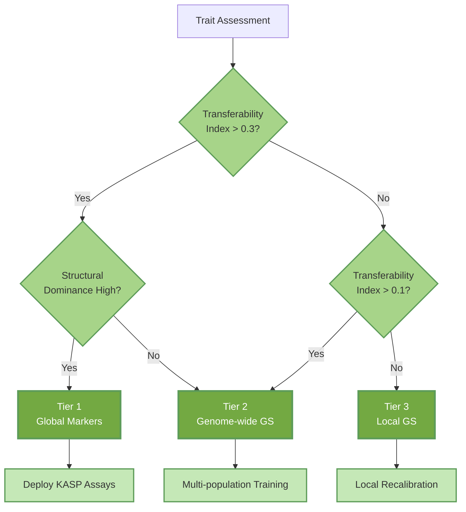

# Mango Structural Super-Genes

[](https://www.python.org/)
[](https://opensource.org/licenses/MIT)
[](https://tensorflow.org/)

**Structural haplotypes act as additive super-genes to bridge the genomic prediction cliff in mango**

---

## Overview

### The Challenge: The Structure Cliff

Genomic selection promises to accelerate tree crop breeding but routinely fails when models are transferred between ancestry groups (e.g., Indian vs. Southeast Asian germplasm). This phenomenon—the **"Structure Cliff"**—has historically limited global breeding efforts, yet lacked mechanistic explanation.

### The Solution: Structural Super-Genes

By integrating 17 megabase-scale inversions with interpretable deep learning in a 225-accession mango diversity panel, we demonstrate that **chromosomal inversions behave as additive super-genes**. These structural blocks allow specific traits to bridge the cliff, retaining predictive power where polygenic signals fail.

**Zero-Cost Deployment:** We convert existing public WGS data into a breeder-ready toolkit—without generating a single new genotype.

---

## Analysis Pipeline


---

## Key Findings

| Discovery | Statistic | Impact |
|-----------|-----------|--------|
| **The "Super-Gene" Effect** | A single 5-SNP inversion block captures ≥80% accuracy of 20k SNPs for fruit colour | Enables low-cost screening with high accuracy |
| **Structure Cliff Quantified** | Polygenic traits lose >100% accuracy (r < 0) across ancestries | Proves local recalibration is mandatory |
| **AI Confirms Additivity** | Virtual editing revealed <0.1% synergy scores | Debunks "hidden epistasis" hypothesis |
| **Genetic Gain Projected** | Tier 1 traits project 16–18% gain per cycle using global markers | Accelerates perennial crop improvement |

---

## Precision Breeding Hierarchy



---

## The Breeder's Toolkit

Beyond the analysis pipeline, this repository provides immediate resources for molecular breeding:

| Resource | Description |
|----------|-------------|
| **Diagnostic Markers** | Flanking sequences for KASP-ready assays targeting portable structural inversions |
| **Haplotype Catalogues** | Effect sizes for key inversions converted into breeder-interpretable units (SD shift) |
| **Genetic Gain Projections** | Estimated gain per cycle for Global (Tier 1) vs. Local (Tier 3) deployment |
| **KASP Panel Design** | 60 bp upstream/downstream sequences for immediate assay development |

---

## Deep Learning for Mechanism, Not Just Prediction

We utilise Wide & Deep networks and Biologically Informed Neural Networks (BINN) not to chase marginal accuracy gains, but as **hypothesis-testing engines**:

| Approach | Insight |
|----------|---------|
| **Saliency Mapping** | Prediction relies on diffuse polygenic backbones, except where structural "knobs" exist |
| **Virtual Allele Editing** | Structural haplotypes act as quasi-Mendelian, additive units with no trade-offs |
| **BINN Decomposition** | ~60% of accuracy gains from biologically informed feature selection; ~40% from architecture |
| **No Cryptic Epistasis** | Models confirm the structure cliff is architectural, not a failure of linear modelling |

---

## Repository Structure

```
├── config/
│   ├── config_idea1.py                     # Genomic prediction parameters
│   ├── config_idea2.py                     # Structural analysis parameters
│   └── config_idea3.py                     # Deep learning parameters
│
├── 01_genomic_prediction/
│   ├── 01_build_core_matrices.py           # Build genotype/phenotype matrices from VCF
│   ├── 01b_het_qc.py                       # Heterozygosity-based paralog removal
│   ├── 02_gs_kfold_baseline.py             # Random K-fold cross-validation baseline
│   ├── 03_gs_structure_aware_cv.py         # Cluster-balanced and leave-cluster-out CV
│   ├── 04_internal_gwas_and_weights.py     # Internal GWAS for SNP weighting
│   ├── 04_gwas_to_snp_weights.py           # Convert GWAS to prediction weights
│   ├── 05_gs_weighted_and_fixed_effects.py # GWAS-weighted genomic selection
│   └── 06_idea1_summary.py                 # Summary statistics and reports
│
├── 02_structural_haplotypes/
│   ├── 01_prepare_idea2_datasets.py        # Prepare ML-ready datasets
│   ├── 02_define_cv_schemes_idea2.py       # Define cross-validation schemes
│   ├── 03_baseline_linear_models_idea2.py  # Ridge regression baselines
│   ├── 04_xgboost_and_rf_models_idea2.py   # XGBoost and Random Forest models
│   ├── 05_model_comparison_idea2.py        # Compare model performance
│   ├── 06_feature_importance_and_postgwas_links_idea2.py  # Feature importance
│   ├── 07_inversion_augmented_gs_idea2.py  # Inversion-augmented prediction
│   ├── 08_random_vs_inversion_control_idea2.py  # Random panel benchmarking
│   ├── 09_permutation_tests_idea2.py       # Permutation significance tests
│   ├── 10_build_gene_annotation_dict_idea2.py   # Gene annotation dictionary
│   ├── 11_build_candidate_gene_tables_idea2.py  # Candidate gene tables
│   ├── 11b_summarise_idea2_results.py      # Results summary
│   ├── 12_inspect_gene_mapping_idea2.py    # Gene mapping inspection
│   ├── 13_generate_manuscript_tables.py    # Generate manuscript tables
│   ├── 14_breeder_effect_catalogue.py      # Haplotype effect catalogue
│   ├── 15_generate_assay_sequences.py      # KASP assay flanking sequences
│   ├── 16_calc_genetic_gain.py             # Expected genetic gain calculation
│   └── 17_idea2_summary.py                 # Summary report
│
├── 03_deep_learning/
│   ├── 00_prep_gwas_summary.py             # Prepare GWAS summary for AI
│   ├── 01_ai_core_data.py                  # Prepare deep learning input data
│   ├── 02_cnn_tensor_builder.py            # Build CNN input tensors
│   ├── 03_train_cnn_single_trait.py        # Single-trait CNN training
│   ├── 04_train_wide_deep_multitask.py     # Multi-task Wide & Deep training
│   ├── 05_model_performance_summary.py     # Model performance metrics
│   ├── 06_ai_saliency_multitrait.py        # Gradient saliency analysis
│   ├── 07_wide_deep_decomposition.py       # Wide vs Deep decomposition
│   ├── 08_virtual_editing_scenarios.py     # In silico allele editing
│   ├── 08c_final_virtual_editing.py        # Final virtual editing analysis
│   ├── 08d_xgboost_verification.py         # XGBoost verification of effects
│   └── 09_ai_vs_gwas_concordance.py        # AI–GWAS concordance analysis
│
├── 04_binn/
│   ├── 10_binn_build_maps.py               # SNP-to-gene connectivity maps
│   ├── 11_binn_model.py                    # BINN architecture definition
│   ├── 12_binn_train.py                    # BINN training pipeline
│   ├── 13_binn_explain.py                  # BINN interpretability analysis
│   ├── 18_export_polygenic_weights.py      # Export polygenic weight vectors
│   ├── 19_shap_robustness_check.py         # SHAP robustness validation
│   ├── 20_generate_hierarchy_figure.py     # Precision breeding hierarchy
│   └── 21_binn_linear_baseline.py          # BINN decomposition analysis
│
├── figures/
│   ├── figure_config.py                    # Shared figure configuration
│   │   # Main Figures
│   ├── figure_1.py                         # Population structure and structure cliff
│   ├── figure_2.py                         # Structural haplotypes as predictors
│   ├── figure_3.py                         # Deep learning confirms additivity
│   ├── figure_4.py                         # Polygenic backbones and gene hubs
│   ├── figure_5.py                         # Precision breeding hierarchy
│   │   # Supplementary Figures
│   ├── figure_S1.py                        # Phenotype distributions and PC3-PC4
│   ├── figure_S2.py                        # GWAS landscape and inversion context
│   ├── figure_S3.py                        # CV diagnostics and structure correction
│   ├── figure_S4.py                        # Random vs inversion panel benchmarks
│   ├── figure_S5.py                        # Deep learning saliency and GWAS concordance
│   └── figure_S6.py                        # BINN training and hub gene details
│
├── utils/
│   └── helpers.py                          # Shared utility functions
│
├── environment.yml
├── requirements.txt
└── README.md
```

---

## Installation

```bash
# Clone repository
git clone https://github.com/shoaibms/mango.git
cd mango

# Create environment
conda env create -f environment.yml
conda activate mango-gs

# Or use pip
pip install -r requirements.txt
```

## Requirements

| Package | Version |
|---------|---------|
| Python | ≥3.9 |
| NumPy | ≥1.21 |
| pandas | ≥1.4 |
| scikit-learn | ≥1.0 |
| XGBoost | ≥1.6 |
| TensorFlow | ≥2.10 |
| SHAP | ≥0.41 |

---

## Data

This study re-analyses publicly available data:

- **Genotypes:** Munyengwa et al. (2025) — 225 accessions, ~10M SNPs
- **Inversions:** Wilkinson et al. (2025) — 17 megabase-scale structural variants
- **Phenotypes:** BLUPs for FBC, FF, AFW, TSS, TC from multi-year trials (1999–2024)

---

## Beyond Mango

While demonstrated in *Mangifera indica*, this workflow—combining **Structure-Aware Cross-Validation**, **Structural Variant Cartography**, and **Interpretable AI**—is designed as a general recipe for any structured, long-lived crop facing strong population stratification:

- Citrus
- Apple
- Grape
- Avocado
- Cacao
- Coffee

The code is modular and adaptable to other species.

---

## Citation

```
[Citation to be added upon publication]
```

## License

MIT License — see [LICENSE](LICENSE) for details.

## Contact

**Shoaib M. Mirza** — shoaibmirza2200@gmail.com

Project: [https://github.com/shoaibms/mango](https://github.com/shoaibms/mango)
